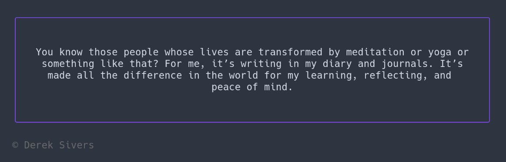
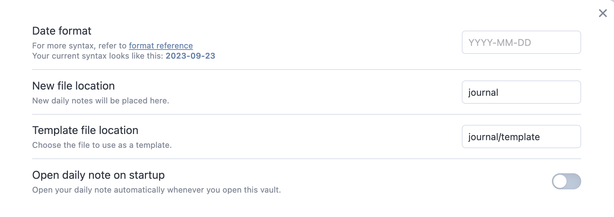

# Stoic



Stoic is a command-line application for daily journaling with plain-text files. It helps maintain day-to-day journaling habit by allowing you to instantly edit current day's entry with console editor of choice.

## Installation

Installation is possible through [Homebrew](https://brew.sh/) on Linux or MacOS.

`brew install skatkov/tap/stoic`

You can also download the executable directly. See the 📥 [Installation](INSTALL.md) instructions.

## Usage

In a terminal:

- `stoic`: open today's journal entry in the editor
- `stoic -list` (beta): list existing entries and pick one for editing
- `stoic -edit "<natural date>"`: open or create the previous day's file using natural dates like "2 days ago" and "yesterday"
- `stoic -quote`: shows a random quote encouraging the journaling habit
- `stoic -about`: shows information about the application

## Configuration

- The editor could be changed by setting the `$EDITOR` global variable. (default: `nano`)
- The directory for a journal could be changed by setting the `$STOIC_DIR` global variable. (default: `~/Journal/`)
- Provide file template through `$STOIC_TEMPLATE` global variable.
- Provide new extension format through `$STOIC_EXT` global variables. (default: `md`)

```shell
export EDITOR="neovim"
export STOIC_DIR="~/MEGAsync/journal/"
export STOIC_TEMPLATE="~/MEGAsync/journal/template.md"
export STOIC_EXT="md"
```

## Motivation

There is a recurring theme in biographies of great people. They had journaling as a hobby.

I've been battling my inner demons with different methods with varying success. But journaling has helped me keep these demons permanently at bay. My sleep will be peaceful if it follows after careful and honest self-examination in my journal.

Existing software for journaling and note-taking is slow to load and filled with features I don't need. Plain-text files stored locally and edited through Nano are enough for journaling. 

However, some recurring manual work is still required with such a simple setup; creating a new daily file and modifying it according to a template. This command line utility completely removes that manual work.

Epictetus, the great Stoic philosopher and slave, once told his students that "philosophy is something one should write down day by day". Hence, the name of this tool is a reference to this great human and a hat tip to the practical philosophy called Stoicism.

## Obsidian integration

I wrote this tool out of frustration with existing note-taking apps (everything has to be in the cloud these days), but other apps followed similar design choices as Stoic did.

I'm now using [Obsidian](https://obsidian.md/) as a fully featured writing app on my laptop and mobile phone. Obsidian comes with core plugins that you can enable. One is "[Daily Notes](https://help.obsidian.md/Plugins/Daily+notes)", which does something similar to Stoic. Nonetheless, I still keep using Stoic as a companion CLI application to Obsidian; with light configuration changes, they play perfectly together.

With the 0.6 version of Stoic, many settings align with those Obsidian defaults. In my case, only two settings are tweaked:

```shell
export STOIC_DIR="~/Obsidian/journal"
export STOIC_TEMPLATE="~/Obsidian/journal/template.md"
```

This closely corresponds to settings I have in obsidian daily notes:


The only thing that Stoic doesn't allow you to tweak is the date format. So, if you have that customized in obsidian, lousy luck.

PRs are welcome. Everything is fixable.

## Development

As a prerequisite, you need to have the [Go compiler](https://golang.org/doc/install).
Please check the [`go.mod`](go.mod) file to see what Go version Stoic requires.

Fetch the sources:

```shell
git clone https://github.com/skatkov/stoic.git
cd stoic
```

To build the project, run:

```
goreleaser build
```

This automatically resolves the dependencies and compiles the source code into an executable for your platform.

## Releasing
Publish to homebrew tap at "skatkov/homebrew-tap" and publish a release in current github repository.

```
goreleaser release
```

## Contributions

This project is my little Go playground. It would be awesome to learn about any appropriate improvements for this codebase.

Everyone is welcome to contribute.

## TODO's

I've been brainstorming for possible improvements, and here is a rough list of ideas in no particular order:

- `stoic -cal`: perhaps with the `bubbletea` TUI framework and the `cal` utility. A calendar view for existing records showing dates marked with green dots if there is a record for that day.
- Improve error handling
- Use a CLI framework like [cobra](https://github.com/spf13/cobra)
- Add Windows support
- Add the ability to store configuration in dotfiles (not just ENV variables), including the ability to add a custom editor, not one defined in `$EDITOR`
- `stoic -stats`: statistics about journaling, % of days journaled, average journal length, etc.

## Feedback

Got some feedback or suggestions? Please open an issue or drop me a note!

- [Twitter](https://twitter.com/5katkov)
- [Personal Website](https://skatkov.com)
